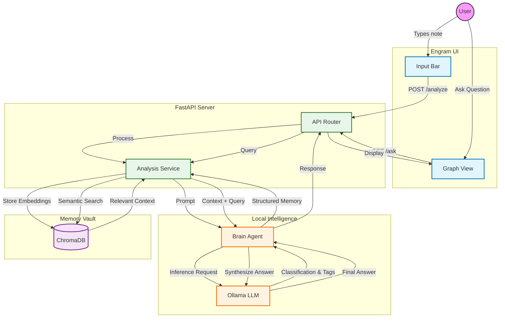

# Architecture & Tech Stack

Engram isn't just a CRUD app; it's a local-first system designed for high-performance memory retrieval and synthesis. Here's a look under the hood.

## 🛠 The Tech Stack

We chose these technologies for a specific reason: **Speed, Privacy, and Control.**

### **Frontend ( The Interface )**
- **React 19**: The latest and greatest for building dynamic UIs.
- **Vite**: For lightning-fast builds and hot reloading.
- **TailwindCSS**: Utility-first styling that lets us move fast.
- **Framer Motion**: For those buttery smooth layout transitions.
- **React Force Graph**: To visualize the neural connections of your notes.
- **Lucide React**: Clean, consistent iconography.

### **Backend ( The Cortex )**
- **FastAPI**: Modern Python web framework. It’s typed, async, and incredibly fast.
- **uvicorn**: The lightning-fast ASGI server.
- **Pydantic**: For rock-solid data validation.

### **The Brain ( AI & Data )**
- **Ollama**: Runs the LLMs locally. No API keys, no monthly bills, total privacy.
- **Llama 3.1**: The reasoning engine. It categorizes, summarizes, and chats with you.
- **Nomic Embed Text**: Converts your notes into vectors (numbers) so the AI can "understand" semantic meaning.
- **ChromaDB**: The vector database where your memories live. It allows us to perform "semantic search" (finding concepts, not just keywords).

---

## 🔄 Data How It Flows

Here is how a thought travels from your brain into Engram's brain.

### Key Concepts

1.  **The "Analyze" Loop**: When you type something, we don't just save text. We send it to Llama 3.1 to ask: *"What is this? Is it a task? A thought? A code snippet?"* It automatically tags and categorizes it for you.
2.  **Semantic Search**: When you search, we don't look for matching words. We compare the *meaning* of your query to the *meaning* of your notes using vector embeddings.
3.  **Local First**: All of this happens on your machine. Your thoughts never leave your laptop.
